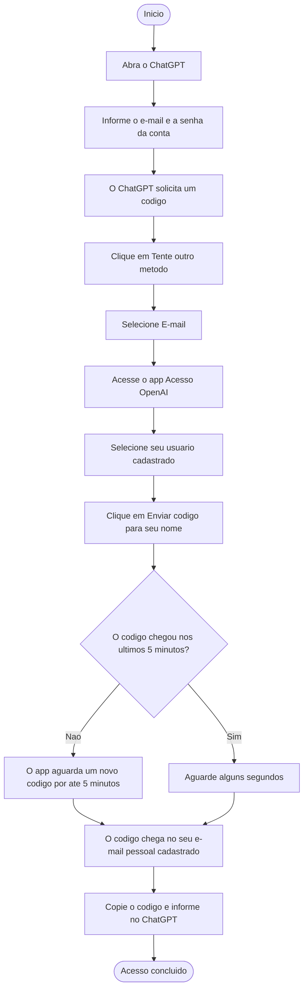

# Como receber seu codigo do ChatGPT

## Passo a passo

1. Abra o ChatGPT e informe o e-mail e a senha da conta.
2. Quando o ChatGPT solicitar um codigo, clique em **Tente outro metodo**.
3. Selecione **E-mail**.
4. Acesse [acesso-gpt-painel.onrender.com](https://acesso-gpt-painel.onrender.com/).
5. Selecione seu usuario cadastrado.
6. Clique em **Enviar codigo para seu nome**.
7. Aguarde alguns segundos.
8. O codigo sera enviado automaticamente para seu e-mail pessoal cadastrado.
9. Copie o codigo recebido e informe no ChatGPT.

> O app aceita um codigo que tenha chegado ao Gmail principal nos ultimos 5
> minutos. Se ele ainda nao tiver chegado, a solicitacao fica ativa e aguarda um
> novo codigo por ate 5 minutos.

## Diagrama

## O que acontece automaticamente

Depois que voce clica em **Enviar codigo para seu nome**, o app reserva sua vez
e verifica se um codigo chegou no e-mail principal nos ultimos 5 minutos.

Se encontrar um codigo recente que ainda nao foi usado, ele e encaminhado
imediatamente para o e-mail pessoal cadastrado. Se nao encontrar, o app aguarda
um novo codigo por ate 5 minutos e o encaminha assim que ele chegar.
